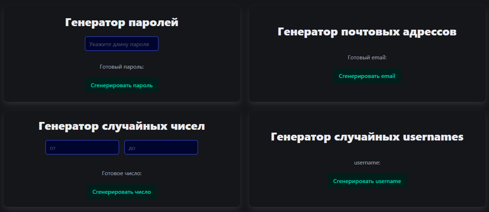

# gen_random_things

## Описание
Мини-приложение, предоставляющее функции генерации рандомных вещей

## Языки и фреймворки
- html
- CSS
- JavaScript (React)

## Скриншоты

## Рабочие особенности
### Генератор паролей
Если не указывать длину, то она будет равна 10

### Генератор случайных чисел
Если не указывать диапазон, то будут взяты числа от 1 до 10

## Автор
- kal1van1ch

## Ссылка
[generate_random_things](https://kal1van1ch.github.io/gen_random_things/)